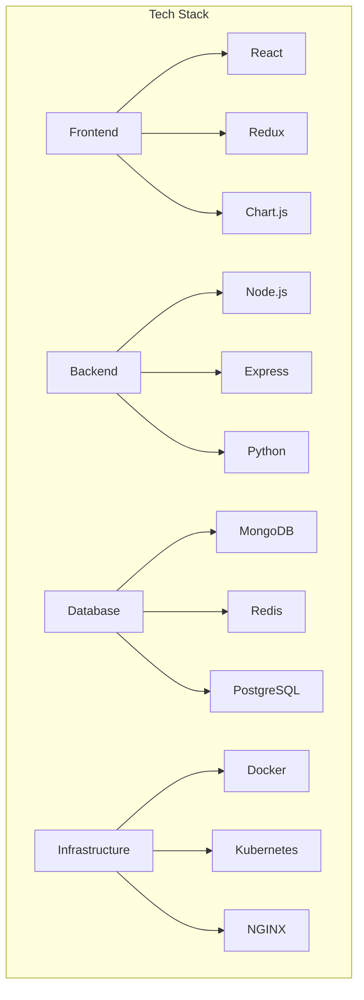
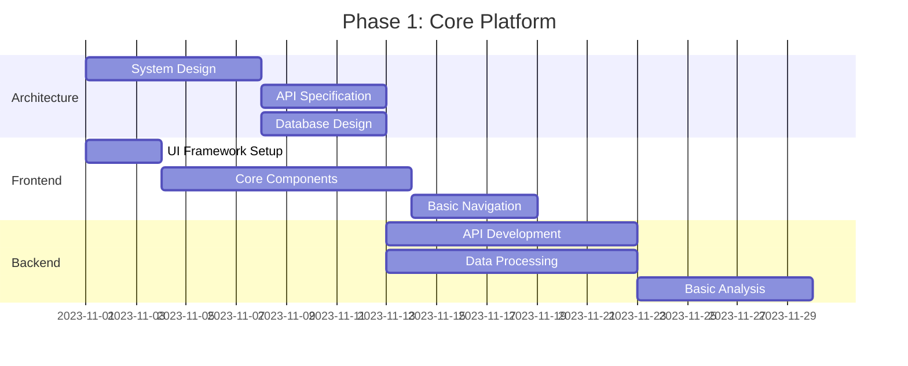
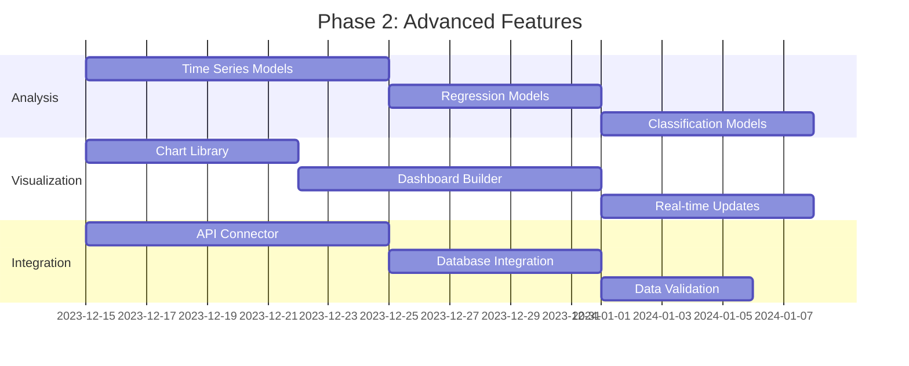
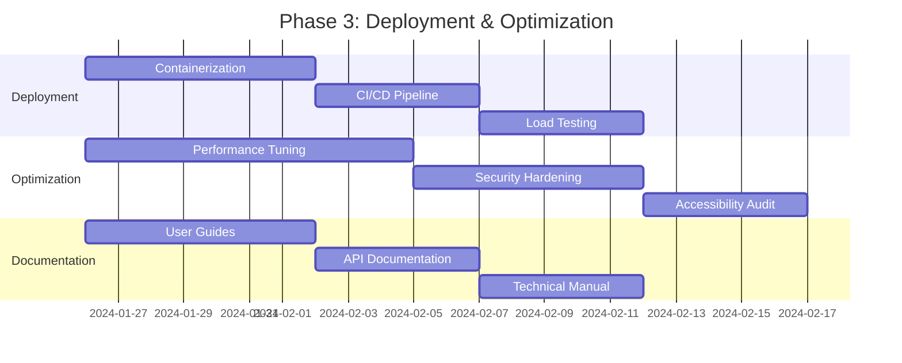

# General Forecasting Tool - Project Requirements Document (v3.0)

## 1. Executive Summary
A no-code analytics platform enabling users to perform advanced data analysis through an intuitive interface, supporting both file-based and live data sources, with automated model deployment capabilities. The platform will provide comprehensive data processing, analysis, and visualization features with robust security and performance.

## 2. Core Features

### 2.1 Data Management
- **File Upload**: Support for CSV, Excel, JSON, XML
- **API Integration**: No-code API configuration
- **Database Connectivity**: SQL and NoSQL support
- **Data Validation**: Real-time data quality checks
- **Data Transformation**: Built-in ETL capabilities

### 2.2 Analysis Capabilities
- **Time Series Analysis**: ARIMA, Exponential Smoothing
- **Regression Analysis**: Linear, Logistic, Polynomial
- **Classification**: Decision Trees, Random Forest, SVM
- **Clustering**: K-Means, Hierarchical, DBSCAN
- **Anomaly Detection**: Statistical, ML-based methods

### 2.3 Visualization
- **Interactive Charts**: Line, Bar, Pie, Scatter
- **Advanced Visualizations**: Heatmaps, Treemaps, Network Graphs
- **Dashboard Customization**: Drag-and-drop interface
- **Real-time Updates**: Streaming data visualization
- **Export Options**: PNG, PDF, CSV

### 2.4 Model Management
- **Model Training**: Automated hyperparameter tuning
- **Model Deployment**: One-click deployment
- **Model Monitoring**: Performance tracking
- **Version Control**: Model versioning
- **Explainability**: SHAP values, Feature Importance

## 3. Technical Requirements

### 3.1 Core Technologies


### 3.2 Performance Requirements
- **Response Time**: < 2 seconds for 95% of requests
- **Concurrency**: Support 50+ concurrent users
- **Data Handling**: Process datasets up to 10GB
- **Uptime**: 99.9% availability
- **Scalability**: Horizontal scaling capability

### 3.3 Security Requirements
- **Authentication**: OAuth2.0, JWT
- **Authorization**: Role-based access control
- **Data Protection**: AES-256 encryption
- **Audit Logs**: Comprehensive activity tracking
- **Compliance**: GDPR, CCPA, HIPAA

## 4. Implementation Phases

### Phase 1: Core Platform (Weeks 1-6)


### Phase 2: Advanced Features (Weeks 7-12)


### Phase 3: Deployment & Optimization (Weeks 13-18)


## 5. Project Timeline
```mermaid
gantt
    title Project Timeline
    dateFormat  YYYY-MM-DD
    section Phases
    Core Platform          :a1, 2023-11-01, 2023-12-15
    Advanced Features      :a2, 2023-12-15, 2024-01-26
    Deployment & Optimization :a3, 2024-01-26, 2024-03-01
    
    section Milestones
    MVP Release            :milestone, m1, 2023-12-15, 0d
    Feature Complete       :milestone, m2, 2024-01-26, 0d
    Production Release     :milestone, m3, 2024-03-01, 0d
    
    section Dependencies
    a1 --> a2
    a2 --> a3
```

## 6. Risk Management

### 6.1 Technical Risks
- Performance bottlenecks with large datasets
- Integration challenges with external APIs
- Model training and deployment complexity

### 6.2 Mitigation Strategies
- Implement distributed computing for large data
- Use API gateway for integration management
- Containerize models for consistent deployment

## 7. Success Metrics
- **User Adoption**: 100+ active users in first month
- **Performance**: < 2s response time for 95% of requests
- **Reliability**: 99.9% uptime in production
- **Accuracy**: > 90% model accuracy for core algorithms
- **Satisfaction**: > 4.5/5 user satisfaction rating

## 8. Future Enhancements
- **Mobile App**: Native iOS and Android applications
- **AI Assistant**: Natural language query interface
- **Collaboration**: Real-time team collaboration
- **Marketplace**: Pre-built model marketplace
- **Automation**: AI-driven workflow automation