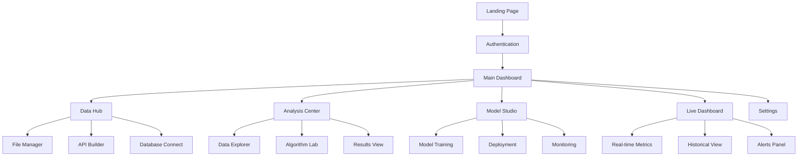
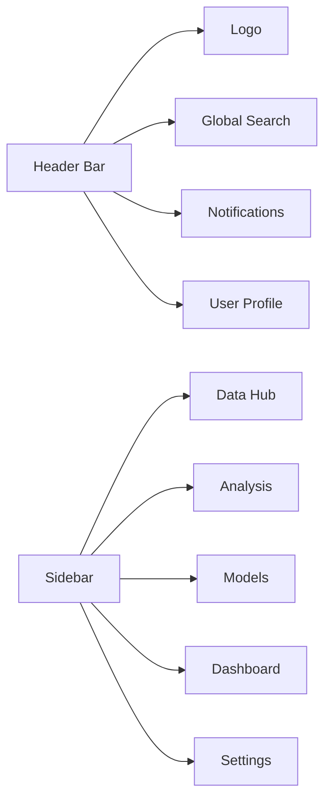
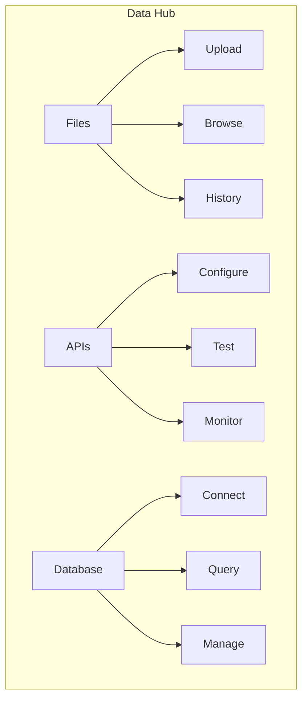

# UI/UX Design Specification (v2.0)

## 1. User Interface Architecture

## 2. Navigation Structure

### 2.1 Primary Navigation

### 2.2 Secondary Navigation

## 3. Page Layouts

### 3.1 Dashboard Layout 