# General Analytics Platform - UI/UX Design Specification (v2.0)

## Executive Summary
This document outlines the complete user interface and user experience design for the General Analytics Platform. The platform provides a no-code analytics solution with support for file-based analysis, live data integration, automated model deployment, and real-time monitoring capabilities.

## Document Version Control
- Version: 2.0
- Last Updated: 16/03/2025
- Status: Draft
- Authors: Snehil Bhadkamkar

## Table of Contents
1. Architecture Overview
   - System Architecture
   - User Interface Architecture
   - Component Hierarchy

2. Navigation & Information Architecture
   - Primary Navigation
   - Secondary Navigation
   - Information Flow
   - User Journeys

3. Layout Specifications
   - Dashboard Layouts
   - Component Layouts
   - Responsive Layouts
   - Grid System

4. Component Library
   - Core Components
   - Form Elements
   - Data Visualization
   - Interactive Elements

5. Interaction Patterns
   - User Workflows
   - State Management
   - Input Handling
   - Feedback Systems

6. Visual Design
   - Color System
   - Typography
   - Iconography
   - Spacing System

7. Animation & Transitions
   - Transition States
   - Loading States
   - Progress Indicators
   - Micro-interactions

8. Data Visualization
   - Chart Types
   - Data Tables
   - Real-time Updates
   - Interactive Features

9. Accessibility Standards
   - WCAG Compliance
   - Keyboard Navigation
   - Screen Readers
   - Color Contrast

10. Performance Guidelines
    - Loading Performance
    - Runtime Performance
    - Optimization Strategies
    - Monitoring

11. Documentation & Help
    - User Documentation
    - Technical Documentation
    - Contextual Help
    - Error Messages

## 1. Architecture Overview

### 1.1 System Architecture
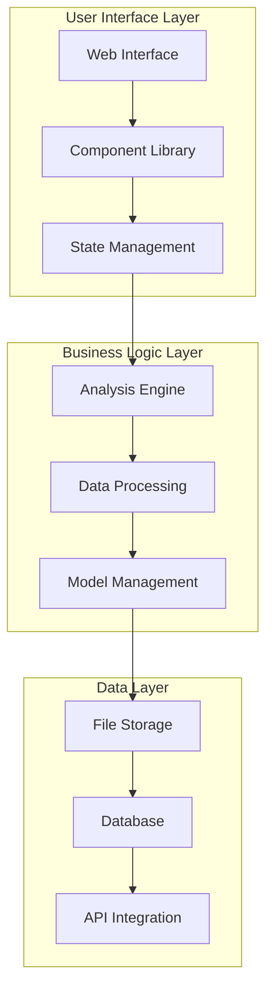

### 1.2 User Interface Architecture
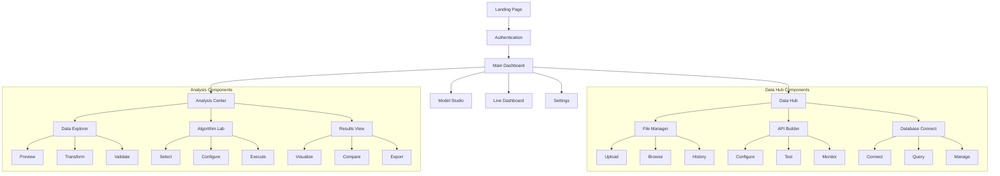

### 1.3 Component Hierarchy
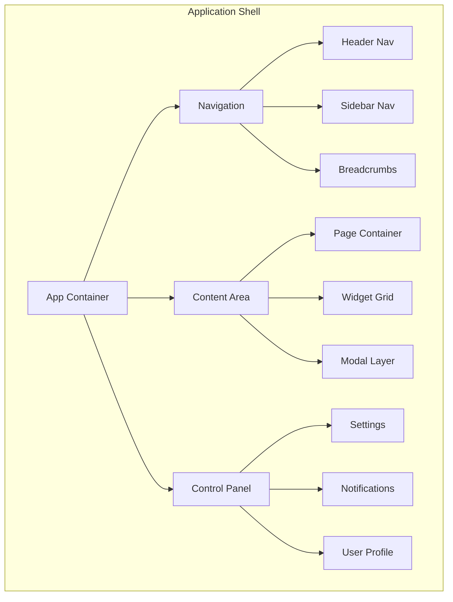

## 2. Navigation & Information Architecture

### 2.1 Global Navigation Structure
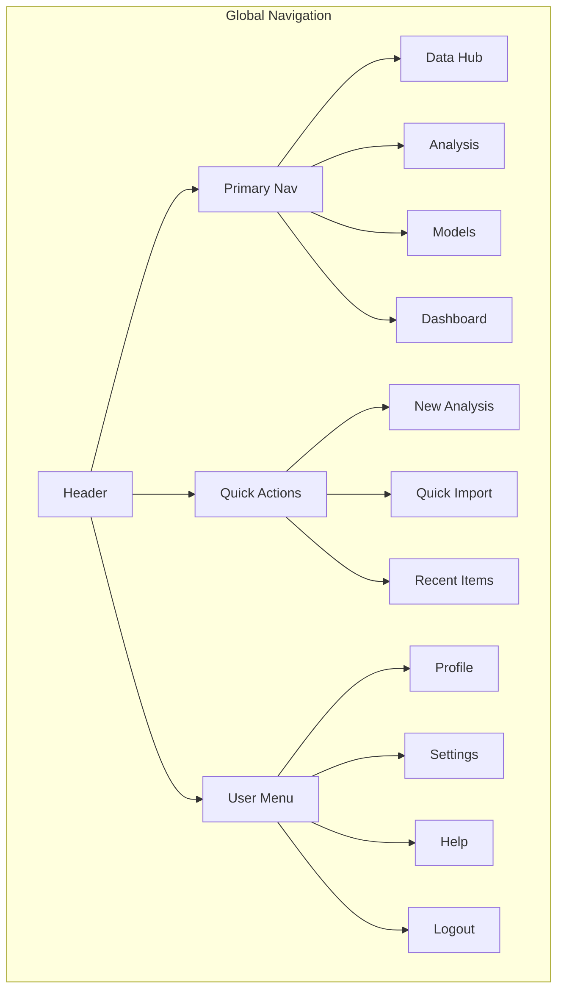

### 2.2 Information Flow
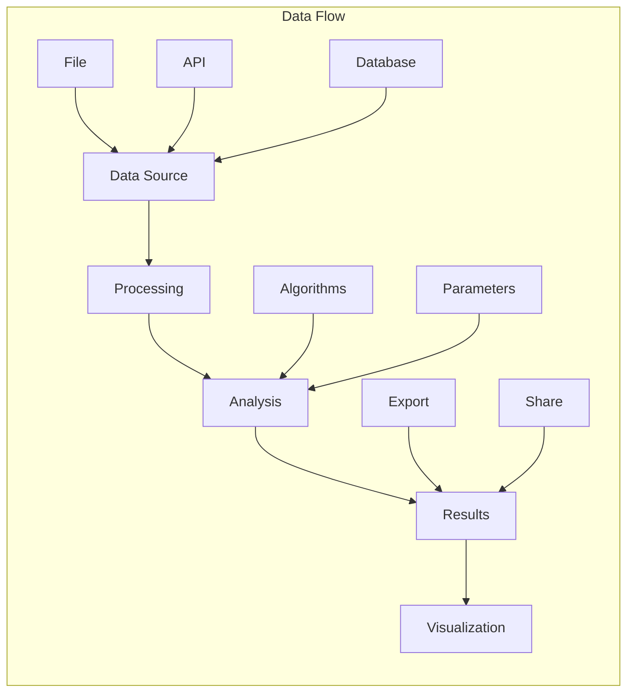

### 2.3 User Journey Map
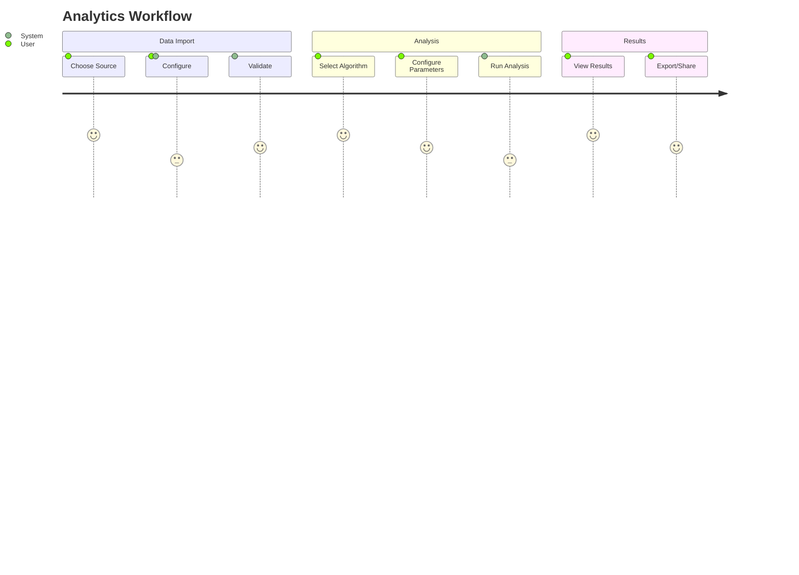

### 2.4 Navigation States
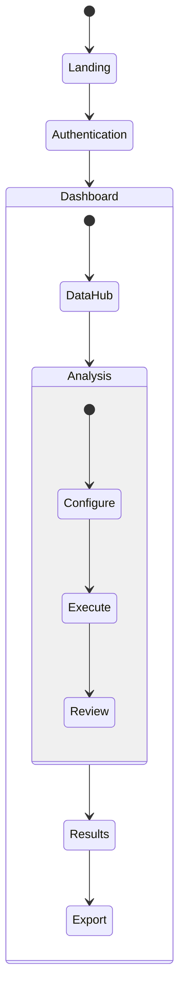

## 3. Layout Specifications

### 3.1 Grid System
```css
.grid-system {
    /* Base Grid */
    display: grid;
    grid-template-columns: repeat(12, 1fr);
    gap: var(--grid-gap);
    
    /* Responsive Adjustments */
    @media (max-width: 768px) {
        grid-template-columns: repeat(4, 1fr);
    }
    
    @media (min-width: 769px) and (max-width: 1024px) {
        grid-template-columns: repeat(8, 1fr);
    }
}
```

### 3.2 Layout Components
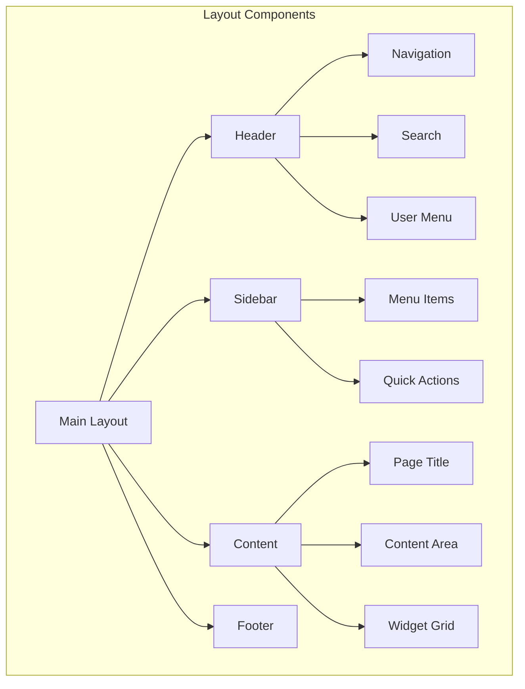

## 4. Component Library

### 4.1 Core Components
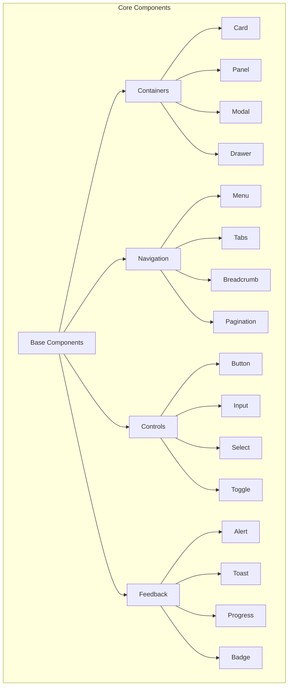

### 4.2 Form Elements
```
+------------------------+
|    Text Input         |
+------------------------+
| Label                 |
| [Input Field       ] |
| Helper Text          |
| Error Message        |
+------------------------+

+------------------------+
|    Select Input       |
+------------------------+
| Label                 |
| [Selected Value   ▼] |
| - Option 1           |
| - Option 2           |
| - Option 3           |
+------------------------+

+------------------------+
|    Date/Time Input    |
+------------------------+
| Label                 |
| [📅 Select Date    ] |
| [🕒 Select Time    ] |
+------------------------+

/* Form Styling */
.form-element {
    --input-height: 40px;
    --input-padding: var(--space-3);
    --label-size: var(--text-sm);
    --helper-size: var(--text-xs);
    --border-radius: 4px;
    --border-color: var(--neutral-300);
    --focus-color: var(--primary-500);
    --error-color: var(--error);
}
```

### 4.3 Advanced Form Components
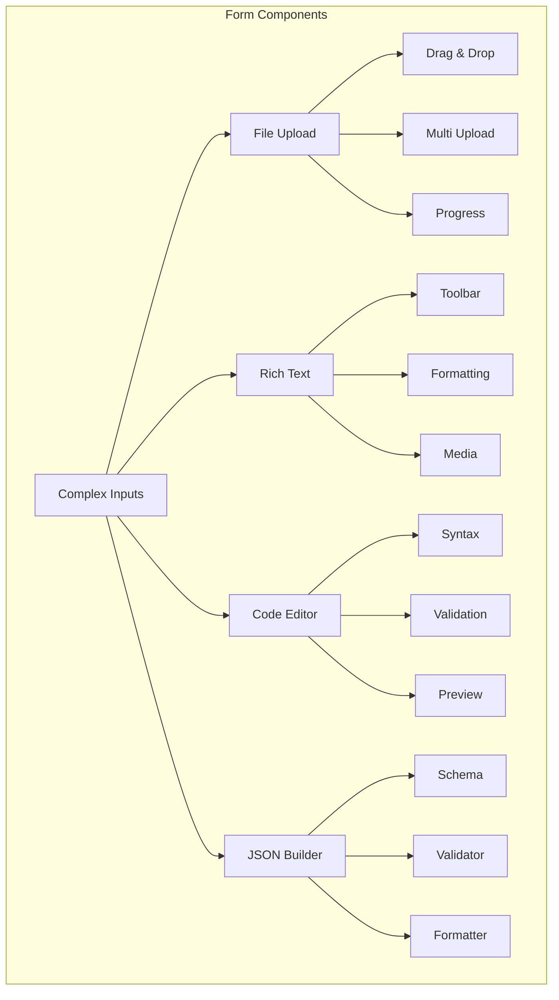

### 4.4 Interactive Elements
```
+------------------------+
|    Slider             |
|  ○───[●]────○        |
|  0   50   100        |
+------------------------+

+------------------------+
|    Range Selector     |
|  ○──[●]──[●]──○      |
|  0  25  75  100      |
+------------------------+

+------------------------+
|    Color Picker       |
| [Selected Color     ] |
| [Color Palette      ] |
| RGB: [Input Fields  ] |
+------------------------+

/* Interactive Element States */
.interactive-element {
    --hover-opacity: 0.8;
    --active-scale: 0.98;
    --disabled-opacity: 0.5;
    --focus-ring: 2px solid var(--primary-300);
}
```

### 4.5 Data Visualization Components
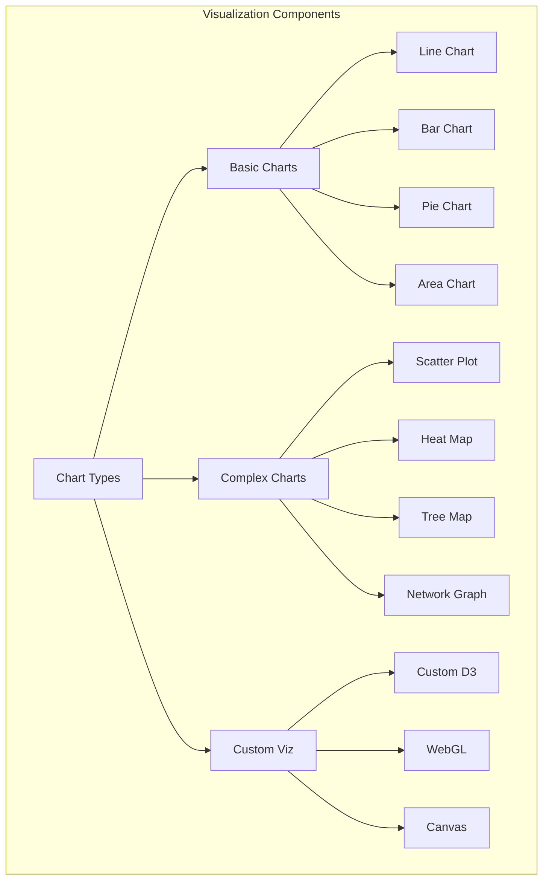

### 4.6 Component States
```css
/* Component State Management */
.component-states {
    /* Base States */
    --state-default: {
        background: var(--neutral-100);
        border: 1px solid var(--neutral-300);
    }
    
    --state-hover: {
        background: var(--neutral-200);
        border-color: var(--neutral-400);
    }
    
    --state-active: {
        background: var(--primary-100);
        border-color: var(--primary-500);
    }
    
    --state-disabled: {
        opacity: 0.5;
        cursor: not-allowed;
    }
    
    /* Feedback States */
    --state-loading: {
        position: relative;
        pointer-events: none;
    }
    
    --state-error: {
        border-color: var(--error);
        background: var(--error-light);
    }
    
    --state-success: {
        border-color: var(--success);
        background: var(--success-light);
    }
}
```

## 5. Interaction Patterns (Enhanced)

### 5.1 User Workflows
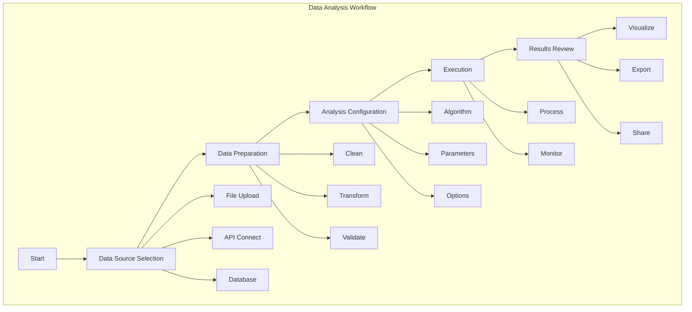

### 5.2 State Management
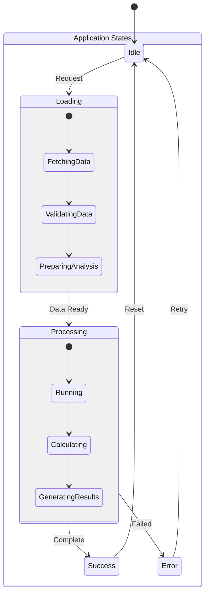

### 5.3 Input Handling System
```typescript
interface InputValidation {
    // Input Types
    type: 'text' | 'number' | 'date' | 'file' | 'custom';
    
    // Validation Rules
    rules: {
        required?: boolean;
        min?: number;
        max?: number;
        pattern?: RegExp;
        custom?: (value: any) => boolean;
    };
    
    // Error Messages
    messages: {
        required: string;
        invalid: string;
        custom: string;
    };
    
    // Transformation
    transform?: (value: any) => any;
}

// Implementation Example
const validationRules = {
    numberInput: {
        type: 'number',
        rules: {
            required: true,
            min: 0,
            max: 100
        },
        messages: {
            required: 'This field is required',
            invalid: 'Please enter a valid number',
            custom: 'Value must be between 0 and 100'
        }
    }
}
```

### 5.4 Feedback Systems (Enhanced)
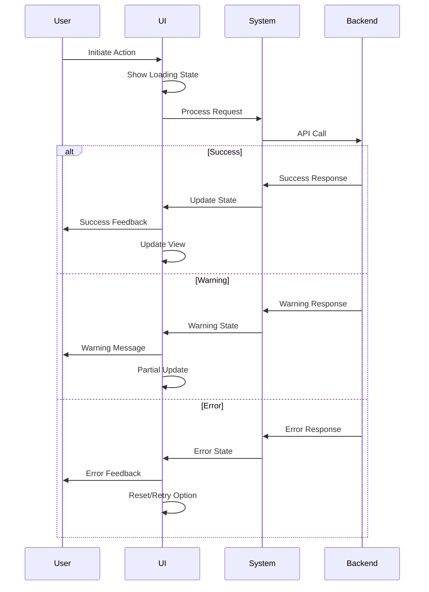

### 5.5 Interaction States
```css
/* Interaction State Definitions */
.interaction-states {
    /* Touch States */
    --touch-target-size: 44px;
    --touch-feedback-color: rgba(0, 0, 0, 0.1);
    
    /* Focus States */
    --focus-outline: 2px solid var(--primary-500);
    --focus-ring-offset: 2px;
    
    /* Drag States */
    --drag-opacity: 0.6;
    --drag-shadow: 0 4px 8px rgba(0, 0, 0, 0.1);
    
    /* Animation Timing */
    --transition-quick: 100ms;
    --transition-normal: 200ms;
    --transition-slow: 300ms;
}
```

### 5.6 Progressive Disclosure
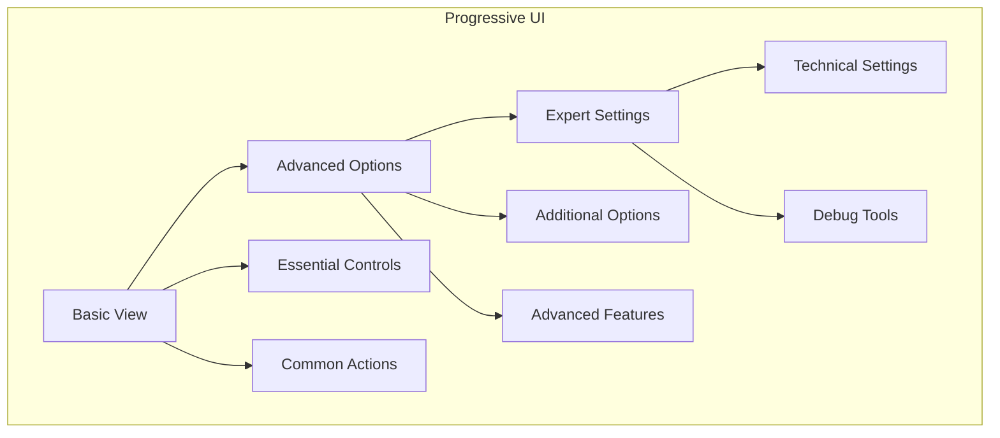

### 5.7 Error Prevention
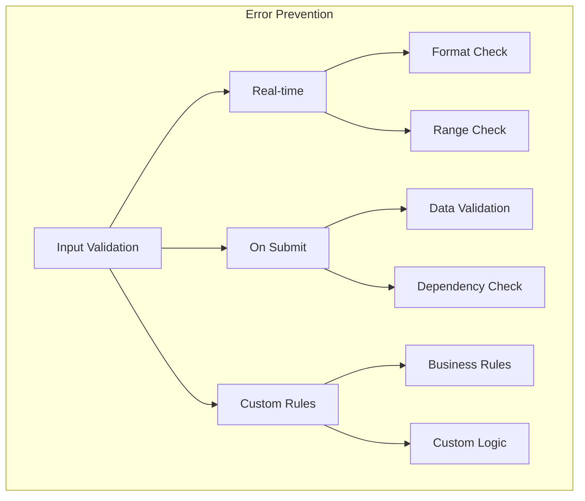

## 6. Visual Design System (Enhanced)

### 6.1 Color System (Extended)
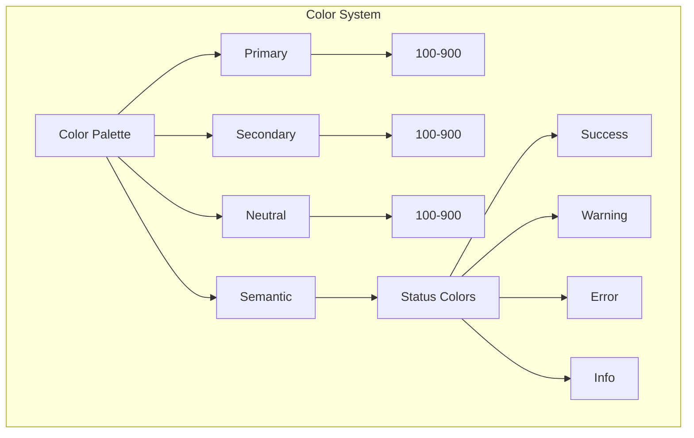

```css
.color-system {
    /* Primary Colors with Alpha Variations */
    --primary-100: hsla(210, 100%, 98%, 1);
    --primary-500: hsla(210, 100%, 50%, 1);
    --primary-900: hsla(210, 100%, 20%, 1);
    
    /* Alpha Variations */
    --primary-500-alpha-10: hsla(210, 100%, 50%, 0.1);
    --primary-500-alpha-20: hsla(210, 100%, 50%, 0.2);
    --primary-500-alpha-50: hsla(210, 100%, 50%, 0.5);
    
    /* Gradient Definitions */
    --gradient-primary: linear-gradient(
        45deg,
        var(--primary-500),
        var(--primary-700)
    );
    
    /* Color Combinations */
    --card-gradient: linear-gradient(
        to right,
        var(--primary-100),
        var(--secondary-100)
    );
}
```

### 6.2 Typography System
```css
:root {
    /* Font Families */
    --font-primary: 'Inter', sans-serif;
    --font-secondary: 'Roboto', sans-serif;
    --font-mono: 'Roboto Mono', monospace;
    
    /* Font Sizes */
    --text-xs: 0.75rem;    /* 12px */
    --text-sm: 0.875rem;   /* 14px */
    --text-base: 1rem;     /* 16px */
    --text-lg: 1.125rem;   /* 18px */
    --text-xl: 1.25rem;    /* 20px */
    --text-2xl: 1.5rem;    /* 24px */
    
    /* Line Heights */
    --leading-none: 1;
    --leading-tight: 1.25;
    --leading-normal: 1.5;
    --leading-relaxed: 1.75;
}
```

### 6.3 Iconography
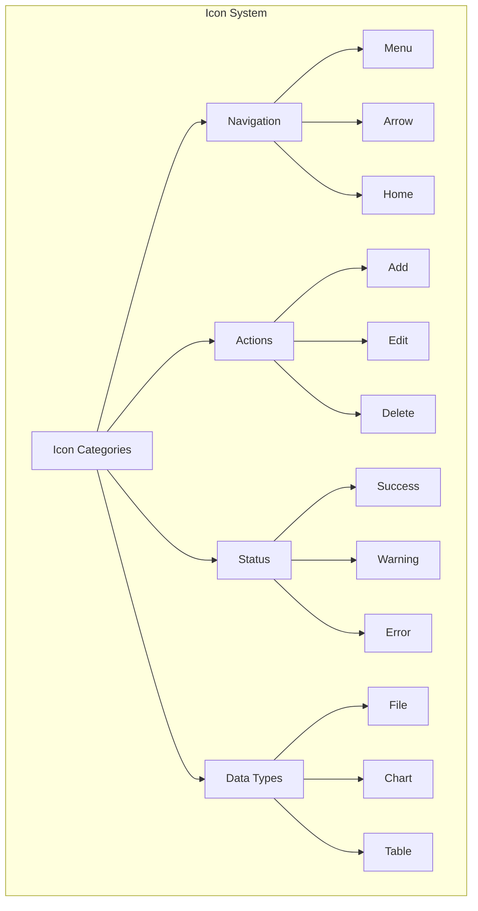

### 6.4 Spacing System
```css
:root {
    /* Base Spacing Unit: 4px */
    --space-1: 0.25rem;   /* 4px */
    --space-2: 0.5rem;    /* 8px */
    --space-3: 0.75rem;   /* 12px */
    --space-4: 1rem;      /* 16px */
    --space-6: 1.5rem;    /* 24px */
    --space-8: 2rem;      /* 32px */
    --space-12: 3rem;     /* 48px */
    --space-16: 4rem;     /* 64px */
}
```

## 7. Animation & Transitions System

### 7.1 Timing Functions
```css
.animation-timing {
    /* Easing Curves */
    --ease-default: cubic-bezier(0.4, 0, 0.2, 1);
    --ease-in: cubic-bezier(0.4, 0, 1, 1);
    --ease-out: cubic-bezier(0, 0, 0.2, 1);
    --ease-in-out: cubic-bezier(0.4, 0, 0.2, 1);
    --ease-bounce: cubic-bezier(0.68, -0.55, 0.265, 1.55);
    
    /* Duration */
    --duration-75: 75ms;
    --duration-100: 100ms;
    --duration-150: 150ms;
    --duration-200: 200ms;
    --duration-300: 300ms;
    --duration-500: 500ms;
    --duration-700: 700ms;
    --duration-1000: 1000ms;
}
```

### 7.2 Motion Patterns
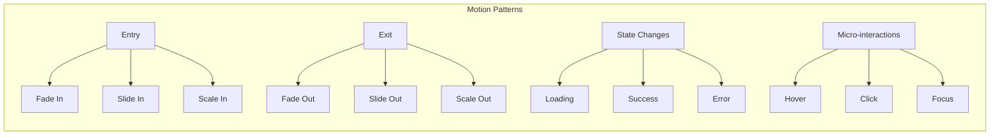

### 7.3 Animation Keyframes
```css
@keyframes fadeIn {
    from { opacity: 0; }
    to { opacity: 1; }
}

@keyframes slideIn {
    from { transform: translateY(20px); opacity: 0; }
    to { transform: translateY(0); opacity: 1; }
}

@keyframes pulse {
    0% { transform: scale(1); }
    50% { transform: scale(1.05); }
    100% { transform: scale(1); }
}

@keyframes spin {
    from { transform: rotate(0deg); }
    to { transform: rotate(360deg); }
}

.animation-utilities {
    --animate-fade: fadeIn var(--duration-300) var(--ease-out);
    --animate-slide: slideIn var(--duration-300) var(--ease-out);
    --animate-pulse: pulse var(--duration-500) var(--ease-in-out) infinite;
    --animate-spin: spin var(--duration-700) linear infinite;
}
```

## 8. Responsive Design System

### 8.1 Breakpoint System
```css
.breakpoint-system {
    /* Modern Breakpoints */
    --screen-sm: 640px;
    --screen-md: 768px;
    --screen-lg: 1024px;
    --screen-xl: 1280px;
    --screen-2xl: 1536px;
    
    /* Container Widths */
    --container-sm: 640px;
    --container-md: 768px;
    --container-lg: 1024px;
    --container-xl: 1280px;
    --container-2xl: 1536px;
}
```

### 8.2 Grid System
```css
.grid-system {
    /* Grid Columns */
    --grid-cols-1: repeat(1, minmax(0, 1fr));
    --grid-cols-2: repeat(2, minmax(0, 1fr));
    --grid-cols-3: repeat(3, minmax(0, 1fr));
    --grid-cols-4: repeat(4, minmax(0, 1fr));
    --grid-cols-6: repeat(6, minmax(0, 1fr));
    --grid-cols-12: repeat(12, minmax(0, 1fr));
    
    /* Grid Gaps */
    --gap-0: 0px;
    --gap-1: 0.25rem;
    --gap-2: 0.5rem;
    --gap-4: 1rem;
    --gap-6: 1.5rem;
    --gap-8: 2rem;
    --gap-12: 3rem;
}
```

### 8.3 Responsive Patterns
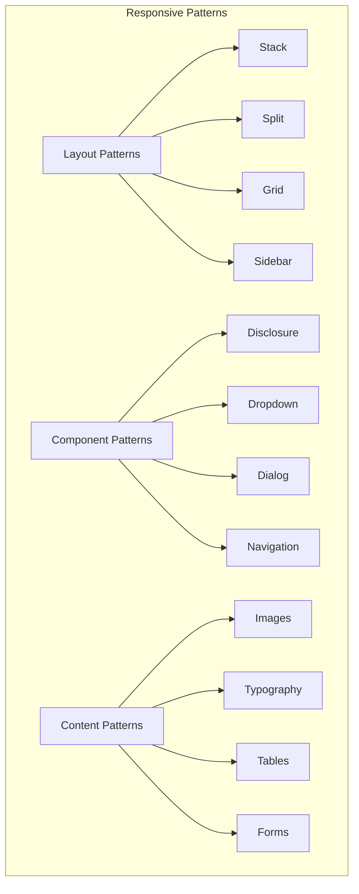

## 9. Accessibility Guidelines

### 9.1 WCAG Compliance Checklist
- **Perceivable**
  - Text alternatives for non-text content
  - Captions and alternatives for multimedia
  - Content adaptable and distinguishable
  - Sufficient color contrast ratios

- **Operable**
  - Keyboard accessible functionality
  - Sufficient time to read content
  - No content that could cause seizures
  - Clear navigation and structure

- **Understandable**
  - Readable and predictable content
  - Clear instructions for interaction
  - Error prevention and handling
  - Consistent navigation and identification

- **Robust**
  - Compatible with current and future tools
  - Valid HTML/ARIA implementation
  - Name, Role, Value for all components

### 9.2 ARIA Implementation
```html
<!-- Example ARIA Patterns -->
<button 
    aria-label="Close dialog"
    aria-expanded="false"
    role="button">
    <span class="sr-only">Close</span>
    <svg aria-hidden="true"><!-- icon --></svg>
</button>

<div 
    role="alert"
    aria-live="polite"
    class="notification">
    <!-- Dynamic content -->
</div>

<nav 
    role="navigation"
    aria-label="Main menu">
    <!-- Navigation items -->
</nav>
```

## 10. Performance Optimization Guidelines

### 10.1 Loading Strategy
```mermaid
graph TD
    subgraph Loading Strategy
        A[Initial Load] --> B[Critical Path CSS]
        A --> C[Above-the-fold Content]
        A --> D[Deferred Loading]
        
        E[Resource Loading] --> F[Lazy Loading]
        E --> G[Preloading]
        E --> H[Prefetching]
        
        I[Image Strategy] --> J[Responsive Images]
        I --> K[Next-gen Formats]
        I --> L[Loading Priority]
    end
```

### 10.2 Performance Metrics
```typescript
interface PerformanceMetrics {
    // Core Web Vitals
    LCP: {
        target: '2.5s',
        measurement: 'largest-contentful-paint',
        priority: 'high'
    };
    FID: {
        target: '100ms',
        measurement: 'first-input-delay',
        priority: 'high'
    };
    CLS: {
        target: '0.1',
        measurement: 'cumulative-layout-shift',
        priority: 'high'
    };
    
    // Additional Metrics
    TTFB: {
        target: '0.8s',
        measurement: 'time-to-first-byte',
        priority: 'medium'
    };
    TTI: {
        target: '3.8s',
        measurement: 'time-to-interactive',
        priority: 'medium'
    };
}
```

### 10.3 Asset Optimization
```yaml
image_optimization:
  formats:
    - WebP
    - AVIF
    - Responsive srcset
  compression:
    quality: 80-85
    progressive: true
    
font_optimization:
  strategies:
    - Font subsetting
    - WOFF2 format
    - Font-display: swap
    
css_optimization:
  strategies:
    - Critical CSS inline
    - Code splitting
    - Minification
    - Purge unused styles
    
js_optimization:
  strategies:
    - Code splitting
    - Tree shaking
    - Dynamic imports
    - Module bundling
```

## 11. Documentation & Help

### 11.1 User Documentation
```markdown
# User Documentation Structure

## Getting Started
- **Quick Start Guide**: Step-by-step instructions for first-time users
- **System Requirements**: Minimum hardware/software specifications
- **Installation Guide**: Detailed installation process for all platforms

## Core Features
- **Data Analysis Workflow**: Visual guide to main features
- **Project Management**: Creating, saving, and organizing projects
- **Collaboration Tools**: Real-time collaboration features

## Advanced Features
- **Custom Scripting**: Guide to writing custom analysis scripts
- **API Integration**: Connecting with external services
- **Automation**: Setting up automated workflows

## Troubleshooting
- Common issues and solutions
- Error code reference
- Support contact information
```

### 11.2 Technical Documentation
```markdown
# Technical Documentation Structure

## API Reference
```typescript
interface API {
    version: string;
    endpoints: {
        data: {
            upload: string;
            query: string;
            delete: string;
        };
        analysis: {
            run: string;
            status: string;
            results: string;
        };
    };
    authentication: {
        token: string;
        refresh: string;
    };
}
```

## System Architecture
```mermaid
graph TD
    A[Client] --> B[API Gateway]
    B --> C[Authentication Service]
    B --> D[Data Processing Service]
    B --> E[Analysis Engine]
    C --> F[User Database]
    D --> G[Data Storage]
    E --> H[Result Cache]
```

## Deployment Guide
- **Local Development Setup**
- **Production Deployment**
- **Scaling Strategies**
- **Monitoring & Logging**
```

### 11.3 Contextual Help
```markdown
# Contextual Help Implementation

## Tooltips
```html
<button 
    aria-label="Save project"
    data-tooltip="Save current project state"
    class="tooltip">
    <span class="sr-only">Save</span>
    <svg><!-- icon --></svg>
</button>
```

## Inline Help
```html
<div class="help-section">
    <h3>Data Import Guide</h3>
    <p>Supported formats: CSV, JSON, XML</p>
    <button 
        aria-expanded="false"
        class="help-toggle">
        Show More
    </button>
    <div class="help-content">
        <p>Detailed format specifications...</p>
    </div>
</div>
```

## Walkthroughs
```javascript
const onboardingTour = {
    steps: [
        {
            target: '#data-import',
            content: 'Start by importing your data here',
            placement: 'right'
        },
        {
            target: '#analysis-panel',
            content: 'Select your analysis parameters',
            placement: 'bottom'
        }
    ],
    options: {
        showProgress: true,
        skipLabel: 'Skip Tutorial'
    }
};
```

### 11.4 Error Messages
```markdown
# Error Handling System

## Error Message Structure
```typescript
interface ErrorMessage {
    code: string;
    title: string;
    description: string;
    solution: string;
    severity: 'info' | 'warning' | 'error';
    timestamp: Date;
    context?: object;
}
```

## Common Error Messages
```yaml
data_import_errors:
  - code: DI001
    title: Invalid File Format
    description: The uploaded file is not in a supported format
    solution: Please upload a file in CSV, JSON, or XML format
    severity: error
    
  - code: DI002
    title: File Size Exceeded
    description: The uploaded file exceeds the maximum size limit
    solution: Please upload a file smaller than 100MB
    severity: warning

analysis_errors:
  - code: AN001
    title: Missing Parameters
    description: Required analysis parameters are missing
    solution: Please fill in all required fields
    severity: error
```

## Error Display Components
```html
<div class="error-message" role="alert">
    <div class="error-header">
        <span class="error-code">DI001</span>
        <span class="error-title">Invalid File Format</span>
    </div>
    <div class="error-body">
        <p class="error-description">The uploaded file is not in a supported format</p>
        <p class="error-solution">Please upload a file in CSV, JSON, or XML format</p>
    </div>
    <button class="error-details">Show Details</button>
</div>
```

## Error Recovery Flow
```mermaid
graph TD
    A[Error Occurs] --> B[Display Error Message]
    B --> C{User Action}
    C -->|Retry| D[Retry Operation]
    C -->|Cancel| E[Return to Previous State]
    C -->|Report| F[Submit Error Report]
    F --> G[Support Team Notification]
```

Would you like me to continue with enhancing other sections of the document or focus on specific aspects of the documentation and help system?

## 12. Accessibility & Inclusivity

### 12.1 Accessibility Standards
```markdown
# Accessibility Implementation

## WCAG 2.1 Compliance
- **Level AA** compliance as minimum standard
- **Level AAA** compliance for critical features
- Regular accessibility audits

## Keyboard Navigation
```html
<div class="navigation" role="navigation" aria-label="Main menu">
    <button tabindex="0">Home</button>
    <button tabindex="0">Analysis</button>
    <button tabindex="0">Reports</button>
</div>
```

## Screen Reader Support
```html
<button 
    aria-label="Export data"
    aria-describedby="export-help">
    <span class="sr-only">Export</span>
    <svg aria-hidden="true"><!-- icon --></svg>
</button>
<div id="export-help" class="sr-only">
    Export data in CSV or JSON format
</div>
```

## Color Contrast
```css
:root {
    --text-primary: #1a1a1a;
    --background-primary: #ffffff;
    --contrast-ratio: 21:1; /* WCAG AAA compliant */
}
```

### 12.2 Inclusive Design
```markdown
# Inclusive Design Principles

## Language Support
- Multi-language interface
- Right-to-left language support
- Localized date/time formats

## Cognitive Considerations
- Clear, concise language
- Progressive disclosure of complex features
- Consistent navigation patterns

## Physical Considerations
- Large click targets (minimum 44x44px)
- Adjustable font sizes
- Reduced motion options
```

## 13. Performance Optimization

### 13.1 Loading Strategy
```markdown
# Performance Optimization

## Critical Resources
```html
<link rel="preload" href="critical.css" as="style">
<link rel="preload" href="main.js" as="script">
```

## Lazy Loading
```html

```

## Code Splitting
```javascript
const AnalysisModule = React.lazy(() => import('./AnalysisModule'));
```

### 13.2 Performance Monitoring
```markdown
# Performance Metrics

## Core Web Vitals
- Largest Contentful Paint (LCP) < 2.5s
- First Input Delay (FID) < 100ms
- Cumulative Layout Shift (CLS) < 0.1

## Custom Metrics
```javascript
const performanceMetrics = {
    dataLoadTime: {
        target: '1s',
        current: '0.8s'
    },
    analysisTime: {
        target: '3s',
        current: '2.5s'
    }
};
```

## 14. Security & Privacy

### 14.1 Security Measures
```markdown
# Security Implementation

## Authentication
```javascript
const authConfig = {
    tokenExpiry: '1h',
    refreshTokenExpiry: '7d',
    passwordPolicy: {
        minLength: 12,
        requireSpecialChar: true,
        requireNumber: true
    }
};
```

## Data Protection
```yaml
data_protection:
  encryption:
    at_rest: AES-256
    in_transit: TLS 1.3
  access_control:
    role_based: true
    permission_levels: 3
```

### 14.2 Privacy Compliance
```markdown
# Privacy Implementation

## GDPR Compliance
- Data minimization
- Right to access
- Right to be forgotten
- Data portability

## Cookie Management
```html
<div class="cookie-consent">
    <p>We use cookies to enhance your experience...</p>
    <button id="accept-cookies">Accept</button>
    <button id="reject-cookies">Reject</button>
    <a href="/privacy-policy">Learn More</a>
</div>
```

## 15. Maintenance & Updates

### 15.1 Version Control
```markdown
# Versioning Strategy

## Semantic Versioning
```yaml
versioning:
  major: Breaking changes
  minor: New features
  patch: Bug fixes
```

## Changelog
```markdown
# Changelog

## [1.2.0] - 2023-10-01
### Added
- New data visualization features
- Export to PDF functionality

### Changed
- Improved performance of data import

### Fixed
- Resolved issue with CSV parsing
```

### 15.2 Update Strategy
```mermaid
graph TD
    A[New Feature Request] --> B[Development]
    B --> C[Testing]
    C --> D[Documentation]
    D --> E[Release]
    E --> F[User Notification]
```

Would you like me to focus on any specific section in more detail or add additional sections to the document?